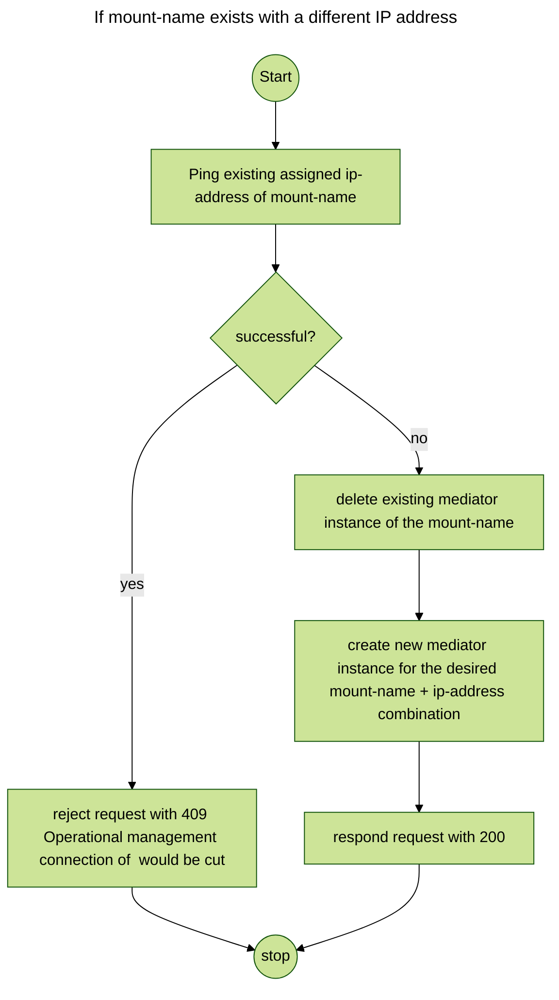

```mermaid
---
title: If mount-name exists with a different IP address
config:
  theme: forest
---
flowchart TB
    start@{ shape: circle, label: "Start" } --> ping1[Ping existing assigned ip-address of mount-name]
    ping1 --> decision1{successful?}
    decision1 --yes--> reject1[reject request with 409 Operational management connection of <mountname> would be cut]
    reject1 --> stop@{ shape: circle, label: "stop" }
    decision1 -- no --> process1[delete existing mediator instance of the mount-name]
    process1  --> process2[create new mediator instance for the desired mount-name + ip-address combination]
    process2 --> process3[respond request with 200]
    process3 --> stop@{ shape: circle, label: "stop" }
```