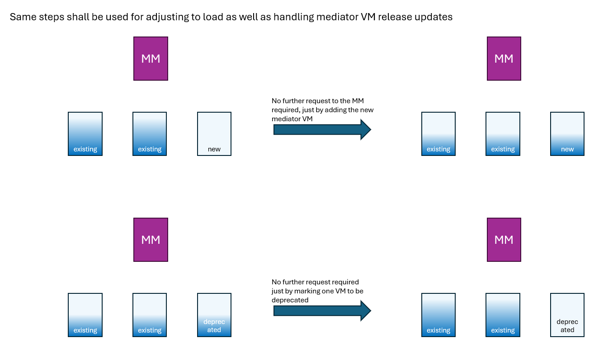
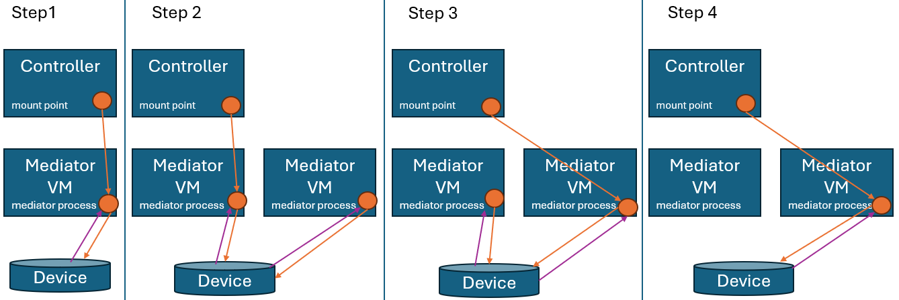

# Drafting the idea of supporting operations through constant load balancing

The MediatorManager shall support continuous operation of the platform by automatically shifting the mediators processes between the available, but not marked deprecated mediatorVMs.  

Problem:  
- If the Controller detects an interuption of the SDN control plane, it is notifying the MWDI, the MWDI is erasing the device from the cache and it takes approximately 8 minutes to restore the device in the cache.  
=> Moving processes between VMs must be non-traffic-affecting

Requirement:  
- There must be an operational connection between a new mediator process and the device, before the mount point inside the controller gets redirected to the new mediator process.  

Further ideas:
- Some report service that is listing key parameters (like, e.g. load) per VM wurde support operation of the mediatorVMs  
- Dismantling a mediatorVM must be refused, if it is still running mediator process  
- Some self-cleaning function shall delete mediator processes that didn’t operate for some longer period  
